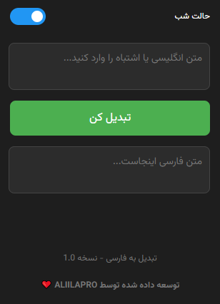
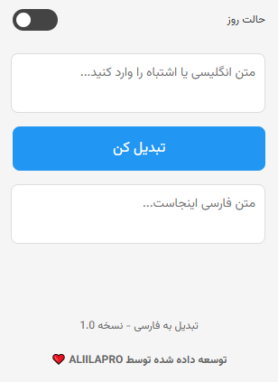

# keyboard-fixer

## افزونه مرورگر

👋 **تبدیل به فارسی** یک افزونه مرورگر است که به شما این امکان را می‌دهد تا متن‌های انگلیسی یا اشتباه تایپی را به متن فارسی تبدیل کنید. همچنین این افزونه قابلیت تغییر تم (حالت شب و روز) را برای راحتی بیشتر کاربران دارد.

  
  

## امکانات

- ✍️ **تبدیل متن انگلیسی به فارسی**: این افزونه حروف انگلیسی را به معادل فارسی آن تبدیل می‌کند.
- 🌙 **حالت شب و روز**: شما می‌توانید بین حالت شب و روز تغییر دهید تا در محیط‌های مختلف راحت‌تر کار کنید.
- 💾 **ذخیره‌سازی تم انتخابی**: تم انتخابی شما در `localStorage` ذخیره می‌شود تا در دفعات بعدی استفاده، تم قبلی حفظ شود.

## اهداف

- 💻 **نسخه گرافیکی برای ویندوز**: یکی از اهداف اصلی، توسعه یک نسخه گرافیکی از این افزونه برای سیستم‌عامل ویندوز است تا کاربران بتوانند از این ابزار در دسکتاپ خود استفاده کنند.
- 🌐 **انتشار در فایرفاکس**: انتشار این افزونه در مارکت فایرفاکس برای دسترسی بیشتر و راحت‌تر کاربران یکی دیگر از اهداف مهم این پروژه است.

## نصب و استفاده

1. 🔽 ابتدا [اینجا](https://github.com/ALIILAPRO/keyboard-fixer/releases/download/V1.0/keyboard-fixer.zip) به صفحه گیت‌هاب پروژه مراجعه کنید.
2. 📥 کد پروژه را دانلود کرده و فایل‌ها را از حالت فشرده خارج کنید.
3. 🚀 به قسمت **Extensions** مرورگر خود بروید (در کروم: `chrome://extensions/`).
4. ⚙️ گزینه **Developer Mode** را فعال کنید.
5. 🔧 روی دکمه **Load unpacked** کلیک کنید و پوشه پروژه را انتخاب کنید.
6. ✅ افزونه با موفقیت نصب می‌شود و آماده استفاده است.

## نحوه استفاده

1. 🔑 بعد از نصب افزونه، آیکون آن در نوار ابزار مرورگر ظاهر می‌شود.
2. ✍️ برای استفاده از افزونه، بر روی آیکون آن کلیک کنید.
3. 🔄 متن انگلیسی یا اشتباه تایپی را در فیلد وارد کنید.
4. 📜 دکمه **تبدیل کن** را فشار دهید تا متن شما به فارسی تبدیل شود.
5. 🌙 برای تغییر تم، از سوئیچ موجود در پنجره افزونه استفاده کنید (حالت شب یا روز).

## توسعه‌دهنده

توسعه داده شده توسط **[ALIILAPRO](https://github.com/aliilapro)** ❤️

## نظرات و پیشنهادات

اگر سوالی دارید یا پیشنهادی برای بهبود افزونه دارید، می‌توانید در گیت‌هاب با ما در تماس باشید.

---

🛠️ **نسخه**: 1.0
